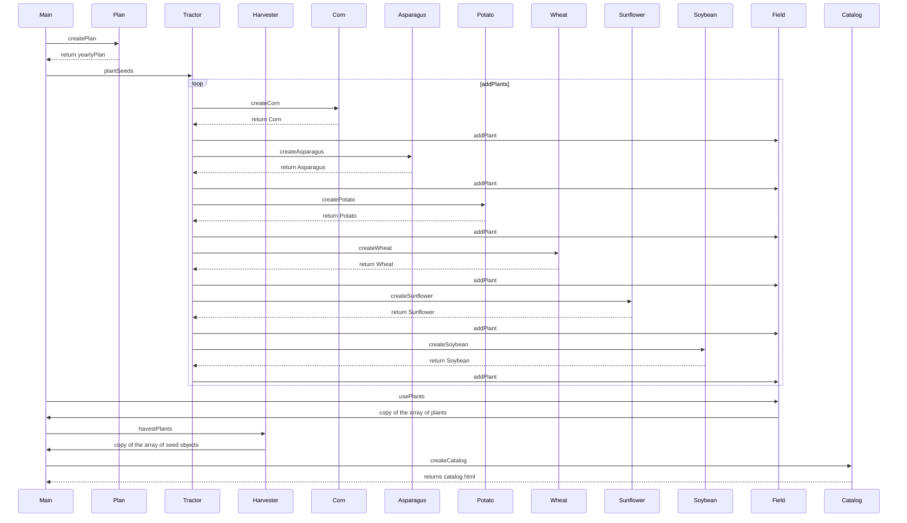

```mermaid
sequenceDiagram
participant Main
participant Plan
participant Tractor
participant Harvester
participant Corn
participant Asparagus
participant Potato
participant Wheat
participant Sunflower
participant Soybean
participant Field
participant Catalog

Main ->> Plan: createPlan
Plan -->> Main: return yearlyPlan
Main ->> Tractor: plantSeeds
loop addPlants
Tractor ->> Corn: createCorn
Corn -->> Tractor: return Corn
Tractor ->> Field: addPlant
Tractor ->> Asparagus: createAsparagus
Asparagus -->> Tractor: return Asparagus
Tractor ->> Field: addPlant
Tractor ->> Potato: createPotato
Potato -->> Tractor: return Potato
Tractor ->> Field: addPlant
Tractor ->> Wheat: createWheat
Wheat -->> Tractor: return Wheat
Tractor ->> Field: addPlant
Tractor ->> Sunflower: createSunflower
Sunflower -->> Tractor: return Sunflower
Tractor ->> Field: addPlant
Tractor ->> Soybean: createSoybean
Soybean -->> Tractor: return Soybean
Tractor ->> Field: addPlant
end
Main ->> Field: usePlants
Field ->> Main: copy of the array of plants
Main ->> Harvester: havestPlants
Harvester ->> Main: copy of the array of seed objects
Main ->> Catalog: createCatalog
Catalog -->> Main: returns catalog.html
```